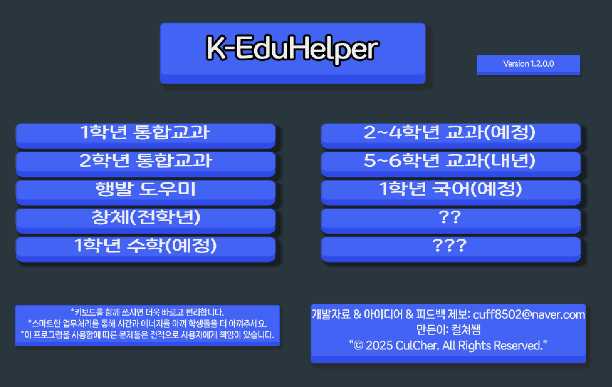
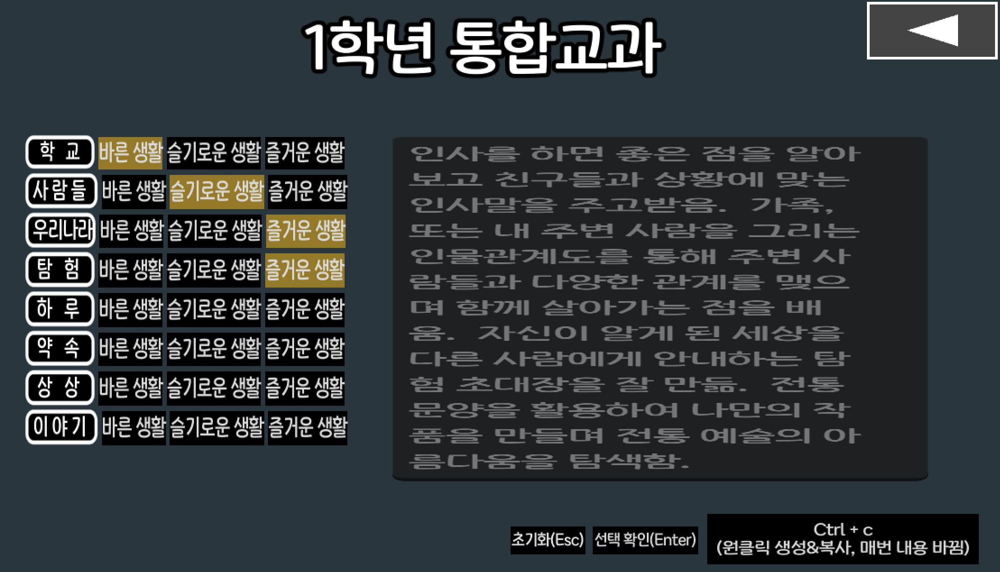
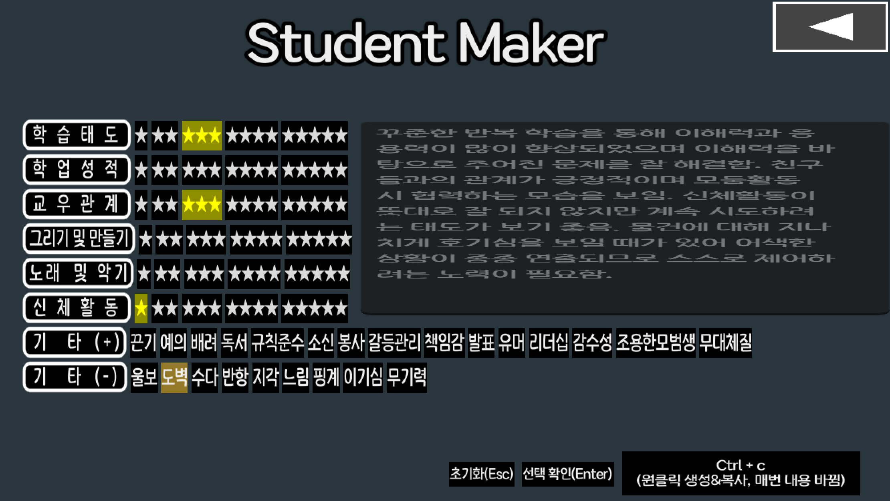
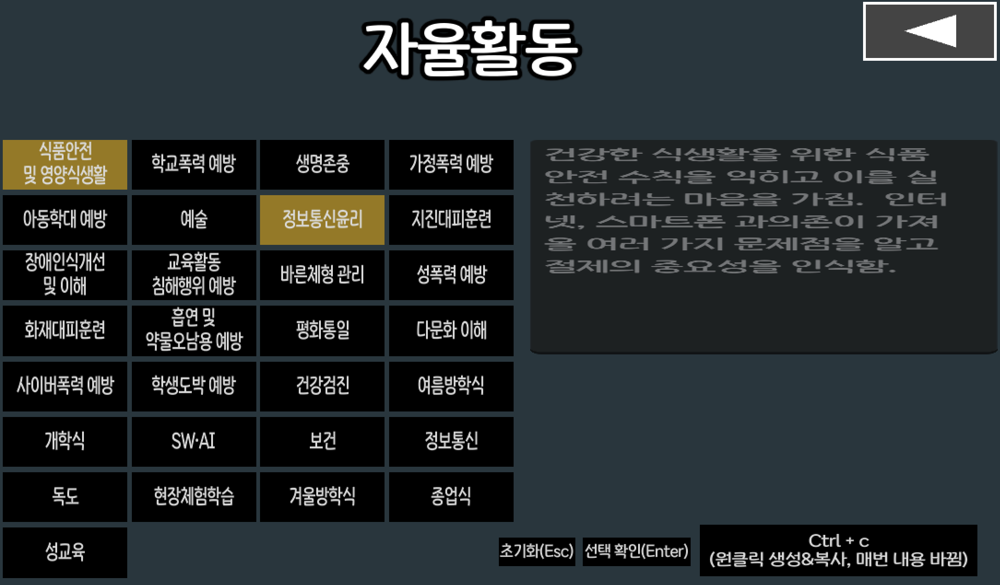

# EduHelper - 초등교사용 성적처리 평가 도구

** EduHelper ** 는 초등학교 교사를 위한 성적 처리 보조 프로그램입니다.  
개인정보 수집 없이, 클릭만으로 평가 문장을 자동 생성할 수 있습니다.

---

## 🧩 주요 기능

- 행발 도우미 [ ⭐ 별점(1~5점) 기반 문장 자동 생성, 학생 개개인의 특성 반영 가능 ]
- 창의적 체험활동(동아리 활동) 평가 포함
- 원클릭으로 평가문단 바꾸기와 클립보드 복사가 동시에
- 중복 방지기능이 적용된 랜덤 문장 생성 기능
- 결과 문장 자동 합치기 및 복사
- 별도의 가입 및 개인정보 입력 없이 사용 가능
- 설치 후 로컬에서 실행 (인터넷 불필요)
- 공공기관에서 사용하기에 전혀 문제가 없는 마이크로소프트 앱스토어 프로그램
- 현직 교사가 직접 개발하여 실용적
- 직관적인 UI를 통해 별도의 사용법을 익힐 필요 없이 바로 사용 가능

---

## 🖥️ 설치 방법

👉 Microsoft Store에서 'EduHelper' 검색 후 설치 or 아래 링크 복사 후 주소창에 붙여넣기  
[🛒 KEduHelper 다운로드](https://apps.microsoft.com/detail/9nfh8hx1t88c?hl=ko-KR&gl=KR)

---

## 🧑‍🏫 누구를 위한 프로그램인가요?

- 초등 교사  
- 성적 처리에 시간을 아끼고 싶은 분  
- 공감과 배려가 담긴 평가 문장을 손쉽게 만들고 싶은 분

---

## 📷 스크린샷

### 🖥️ 메인 화면

### 🧩 창의적 체험활동 화면

### 🏫 통합교과 화면

### 👤 학생 생성 화면

### 🕹️ 자율활동 화면

---

## ✍️ 개발자 노트

“성적 처리에 시간을 덜고, 더 중요한 교육 활동에 집중할 수 있도록 만든 도구입니다.”

개발자: CulCher (초등교사)  
이메일: cuff8502@naver.com

---

## 🗓️ 업데이트 로그

📂 `docs/update_log.md` 파일에 작성 예정

---

## 🗣️ 피드백 & 후원

피드백은 깃허브 이슈로 남겨주시거나 이메일로 보내주세요.  
응원이나 사용 후기 남겨주시면 큰 힘이 됩니다!
